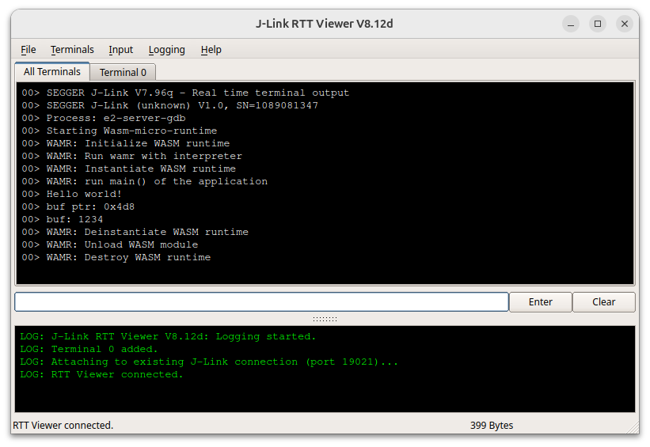

# WebAssembly (Wasm) over Renesas R9A02G021 Fast Prototyping Board
This project evaluates the running of Wasm on the Renesas R9A02G021 Fast Prototyping Board using the [wasm-micro-runtime](https://github.com/bytecodealliance/wasm-micro-runtime) (WAMR). 
Currently, this build includes "Hello World" and an image processing application, both compiled from C and Rust.

## Hardware
The [Renesas R9A02G021 Fast Prototyping Board](https://www.renesas.com/en/products/microcontrollers-microprocessors/risc-v/fpb-r9a02g021-fpb-r9a02g021-risc-v-mcu-fast-prototyping-board) is used in this project.

## Software
We use e2 studio and SEGGER™ J-Link™ Software Package for developing and debugging. These softwares can run on both Windows and Linux environment. In addition, some additional tools maybe needed while working with Wasm:
- [WABT: The WebAssembly Binary Toolkit](https://github.com/WebAssembly/wabt).
- [wasm-micro-runtime](https://github.com/bytecodealliance/wasm-micro-runtime) testing tools.
- [WASI SDK](https://github.com/WebAssembly/wasi-sdk).


## Integrate WAMR to Renesas RISC-V MCU project
#### Step 1: Install necessary softwares.
- Setup [e2 studio]((https://www.renesas.com/en/products/microcontrollers-microprocessors/risc-v/fpb-r9a02g021-fpb-r9a02g021-risc-v-mcu-fast-prototyping-board#design_development)) and [SEGGER™ J-Link™ Software and Documentation Package](https://www.renesas.com/en/products/microcontrollers-microprocessors/risc-v/fpb-r9a02g021-fpb-r9a02g021-risc-v-mcu-fast-prototyping-board#design_development).


### Step 2: Create new project
- Clone this repo.
    ```
    $ git clone https://github.com/trongpc264/Renesas_R9A02G021_Wasm.git
    ```
- Import the ```R9A02G021_WAMR_Interp_HelloWorld``` project to e2 studio.

### Step 3: Build and Debug
- Build project in e2 studio and start debugging.
- Open JLinkRTTViewer to monitor output messages like the image below.
<center></img></center>


## References
Here are some references to understand how WAMR work with the bare-metal environment in this project.
- [Porting WAMR to a new platform](https://github.com/bytecodealliance/wasm-micro-runtime/blob/main/doc/port_wamr.md)
- [Understand WAMR stack](https://bytecodealliance.github.io/wamr.dev/blog/understand-the-wamr-stacks/)
- [Understand WAMR heap](https://bytecodealliance.github.io/wamr.dev/blog/understand-the-wamr-heaps/)
- [Export native API to WASM application](https://github.com/bytecodealliance/wasm-micro-runtime/blob/main/doc/export_native_api.md)